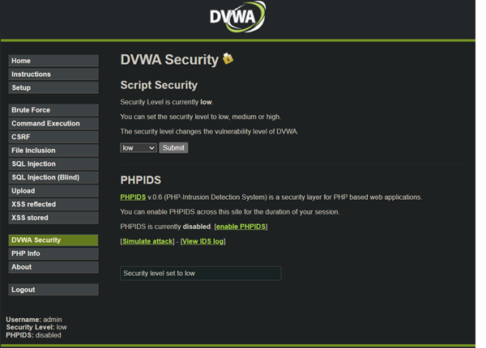
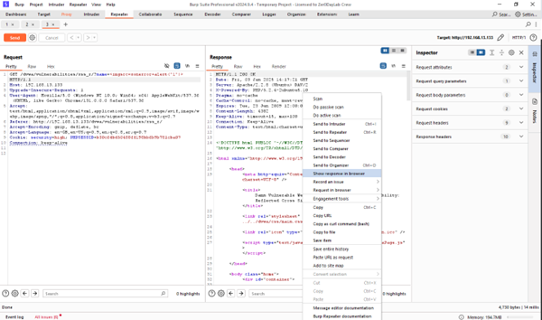

<div id="top"></div> <h2 align="center">Software Security Project</h2> <h3 align="center">Ahmed Walid</h3> <h3 align="center">Ahmed Mohamed</h3> <h3 align="center">AlSayed Aly</h3> <h3 align="center">Omar Shereif</h3>     
 <p align="center">        
    Software Security Project        
    <br />        
 <a href="https://github.com/ahmeddwalid/SoftSecProj/blob/main/README.md"><strong>Explore the docs »</strong></a>        
 <br />        
 <br />        
 <a href="https://github.com/ahmeddwalid/SoftSecProj/issues">Report Bug</a>        
    ·        
    <a href="https://github.com/ahmeddwalid/SoftSecProj/pulls">Request Feature</a>        
 </p>   
<!-- TABLE OF CONTENTS -->

<details>  
 <summary>Table of Contents</summary>  
 <ol>  
 <li>  
 <a href="#about-the-project">About The Project</a>  
 </li>  
 <li><a href="#features">Features</a></li>  
 <li><a href="#contributing">Contributing</a></li>  
 <li><a href="#license">License</a></li>  
 <li><a href="#contact">Contact</a></li>  
 <li>  
 <a href="#acknowledgments">Acknowledgments</a>  
 </li>  
 </ol> </details>   
<!-- ABOUT THE PROJECT -->  
## About The Project

<!-- FEATURES -->

## Features

- **Secure** trust me bro


---

### Part 1:

Very Secure Java Project

Do you really need to know more?

### Part 2:

#### The first step is to open METASPLOIT2 to initiate the exploitation of vulnerabilities :

1. Obtain the IP address by the "ifconfig" command
   
2. Open the acquired Ip address in the browser and navigate to **DVWA**, select **DVWA Security**, and choose the desired security level
   

#### Prepare Burp Suite as follows:

1. Open the tool and press Start
   
2. Target Scoping: Analyze the spidering results to identify high-value targets, such as:

   - User input fields in forms (e.g., login, registration, search).
   - Dynamic parameters in URLs.
   - Cookies and session-related data.
     
     Once the scope and security level are selected, proceed to:

#### Vulnerability Assessment

1. Reflected XSS (Levels: Easy, Medium, High)
   - Steps:
     - Enter the username and password >>>test
     - Activate the proxy and turn "Intercept" on.
     - Identify the request, edit it, and send it to the repeater.
       
     - Send it to the repeater and insert the payload: <script>alert(1)</script>
       

- Vulnerability Exploited successfully
  

For higher levels, the same methodology is repeated:

- **Medium:** Payload: `<SCRIPT>alert(1)</script>`
  
  
  
- **High:** Payload: ``

  
  
  

---

2. Stored XSS
   Follow the same levels and methodology as for reflected XSS
   
   
   
   

---

3. Brute Force Attacks
   1. Enter the username and password, then enable the proxy
   2. Send the request to the Intruder, select the key (e.g., "test"), and press "Add$"
   3. Write the payloads and start the attack
      
   4. Analyze the results: Look for changes in response length to identify the correct payload
      

4. SQL injection

````
1' OR '1'='1'#
'UNION SELECT user, password FROM users --
'UNION SELECT user, password FROM users --
'UNION SELECT table_name, NULL FROM information_schema.tables --
````


---

### **Summary**
**List of Identified Vulnerabilities**
1. **SQL Injection**
    - **Description:** Exploiting SQL queries by injecting malicious inputs to gain unauthorized access or manipulate the database.
    - **Potential Impact:**
        - Unauthorized access to sensitive data.
        - Data corruption or deletion.
        - Full database compromise.
    - **Recommendations:**
        - Input validation.
        - Use parameterized queries or stored procedures.
        - Restrict database user permissions.
        - Avoid exposing detailed error messages.

2. **Cross-Site Scripting (XSS)**
    - **Description:** Injecting malicious scripts into web pages to affect users.
    - **Potential Impact:**
        - Session cookie theft.
        - Web page defacement.
        - Malware spread.
        - Loss of trust.
    - **Recommendations:**
        - Sanitize inputs.
        - Implement a Content Security Policy (CSP).
        - Encode user inputs.
        - Use HTTPOnly and Secure flags for cookies.

3. **Brute Force Attacks**
    - **Description:** Systematic attempts to guess user credentials.
    - **Potential Impact:**
        - Unauthorized account access.
        - Exploitation of user privileges.
        - Account lockouts.
    - **Recommendations:**
        - Account lockout mechanisms.
        - Implement CAPTCHAs.
        - Enforce strong password policies.
        - Use multi-factor authentication (MFA).
        - Monitor failed login attempts.

---

<!-- CONTRIBUTING -->

# Contributing

Any contributions you make are **greatly appreciated**.

Project Link: [https://github.com/ahmeddwalid/SoftSecProj](https://github.com/ahmeddwalid/SoftSecProj)

<!-- LICENSE -->

# License

This project is distributed under the [Apache 2.0 license](https://choosealicense.com/licenses/apache-2.0/). See
[```LICENSE.txt```](/LICENSE) for more information.

<!-- CONTACT -->

# Contact

Ahmed Walid

- [Email](ahmedwalid.c3301@gmail.com)

Ahmed Mohamed

- [Email](ahmedelgeen3@gmail.com)

Alsayed Aly

- [Email](sayedalymadany@gmail.com)

Omar Sherief

- [Email](omarserif2003@gmail.com)

<!-- ACKNOWLEDGMENTS -->

# Acknowledgments

* [Java Documentation](https://docs.oracle.com/en/java/)

<p align="right">(<a href="#top">back to top</a>)</p>
